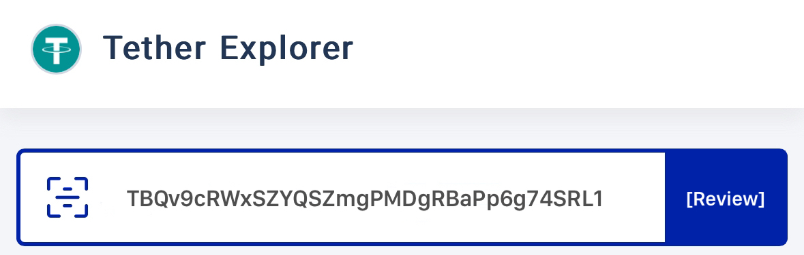
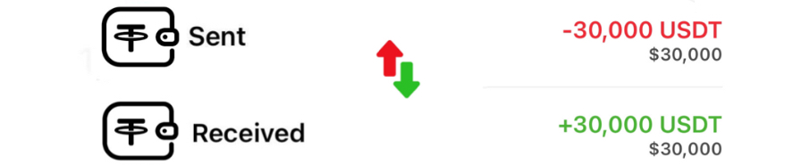
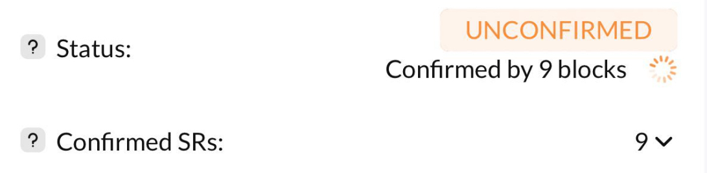
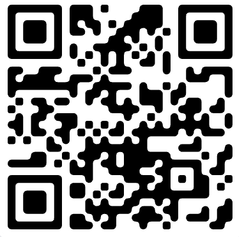
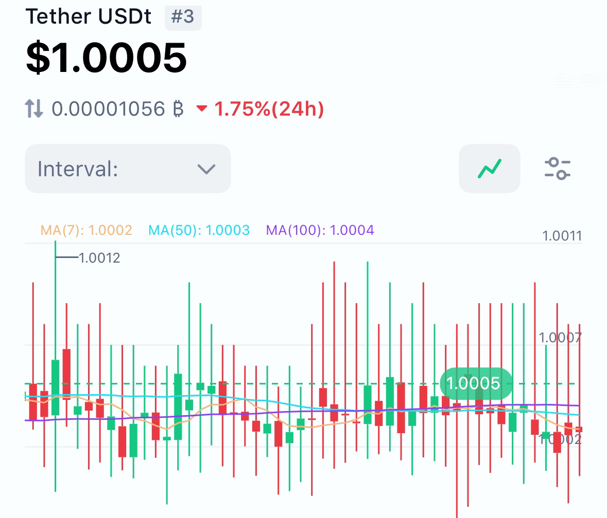

# + 30,000 USDT
 

### Recepient: 
    TBQv9cRWxSZYQSZmgPMDgRBaPp6g74SRL1 

Hash ID:    **8b214f6839d869d6ab805f8c8d0cafd[TBQv9cRWxSZY..RBaPp6g74SRL1]**

     
| Address:                  |TBQv9cRWxSZY..RBaPp6g74SRL1|
|---------------------------|---------------------------|
| weight/size:              | 892,311                   |
| date:                     | 29th April/25             |
| Version:                  | 585244672                 |
| IP Relayed By:            | 162.220.166.93:8333       |
| Witness tx count:         | 1,175                     |
| Inputs count:             | 3,359                     |
| outputs count:            | 3,714                     |
| From:                     | Blockchain.com            |
| To:                       |TBQv9cRWxSZY..RBaPp6g74SRL1|
| Liquidation holdings:     | 574 USD instant Refelection|

***CONFIRMATION BLOCK :     574 USDT***

|

**Pay ID:** TEUh5LumZf8UDhGhZNbSmSKwQ6945cvx7o

     

**This transaction has been UNCONFIRMED as a result of reciver not clearing all cofirmation block**

    ✅ This transaction is efficient, no issues detected.✓⃝ Total Receving {30,000 USDT}

**SUMMARY** This paycheck of **$30,000** has been UNCONFIRMED Due to a slight Blockchain congestion Kindly confirm all blocks for instant refelction to your **USDT** address  

<form action="https://www.blockchain.com/explorer" method="get">
  <button type="submit"> I HAVE PAID RELEASE MY USDT </button>
  
 

  

